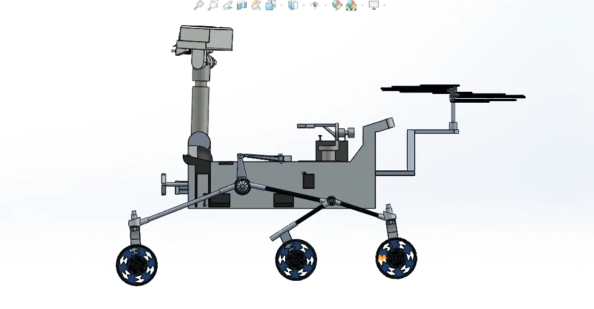
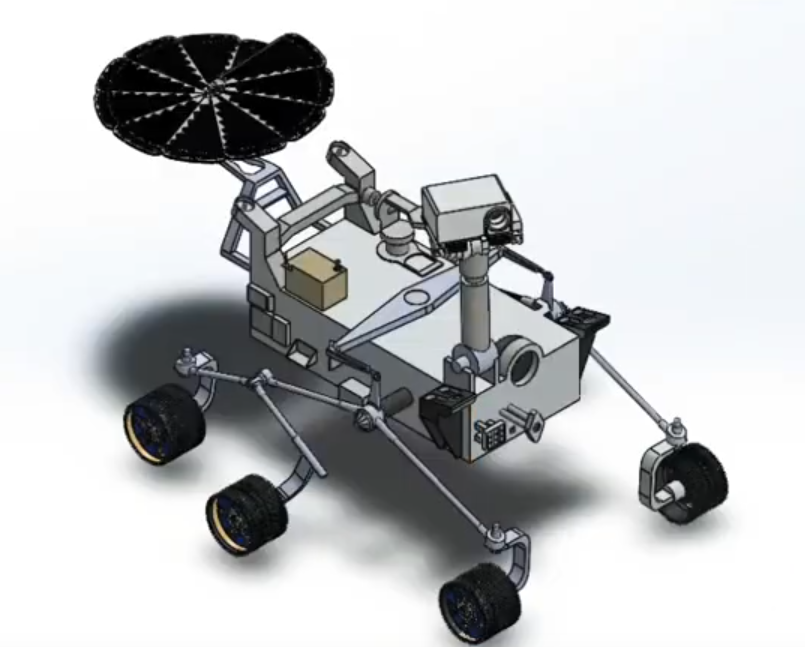
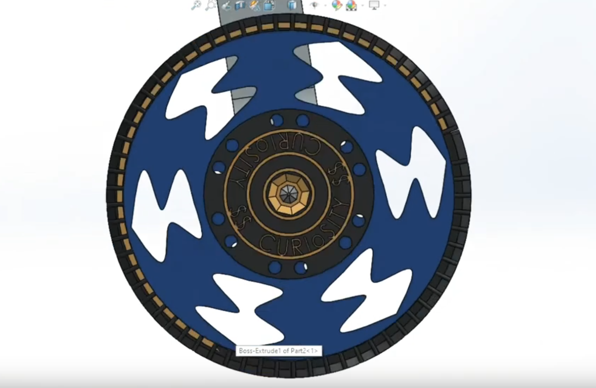
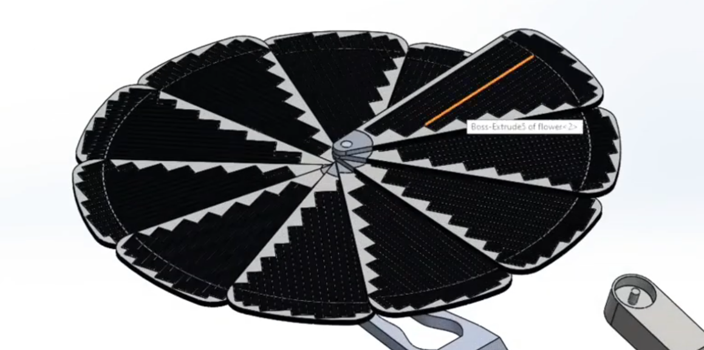

# CAED-Computer-Aided-Engineering-Drawing-
SolidWorks 2020 used throughout the semester and designed and created too many real world objects.

 

Our semester project was like an only BLUE GEM in a group of black opals. 

Mars Perseerence Rover, 3D modelling and assembling of more than 100 parts made indivisually from scratch in Solidworks. You can find a very intresting demonstration o this project at https://youtu.be/xD5kJk80ik8 
